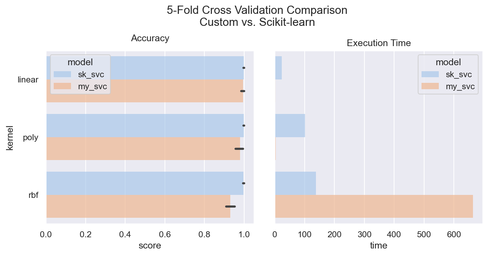

# RNA-seq Classification with Custom SVM

## 1. Transcriptomics and RNA-Seq Data

[Transcriptomics](https://en.wikipedia.org/wiki/Transcriptomics_technologies) concerns the study of RNA expression levels and offers an alternative to genomics for deriving actionable insights for applications such as personalized medicine.

Improved methods of RNA sequencing correspond with a growth in data uniformity, resolution, availability, and dimensionality. The latter in particular presents challenges for more traditional methods of analysis, and significant efforts in transcriptomics have been dedicated to the identification of significant biomarkers. However, machine learning techniques and scalable data solutions may offer solutions for holistic analysis without the downsides of feature selection.

## 2. SVMs for RNA-Seq Analysis

[Support Vector Machines (SVMs)](https://en.wikipedia.org/wiki/Support_vector_machine) are a powerful machine learning solution for data classification, but can also be adapted for other tasks such as regression. They have severable desirable characteristics for processing RNA-seq data.

The first is an aptitude for handling high dimensional data; built-in regularization mitigates the curse of dimensionality. This underlies successful applications in natural language processing tasks.

The second is the flexibility of the model's learning algorithm. Though SVMs traditionally use a quadratic programming approach called Sequential Minimal Optimization (SMO), stochastic or mini-batch subgradient methods can be employed for large enough datasets or online learning settings. In other words, there are scalable variants.

## 3. This Project

This repo contains code, data, a presentation, and report applying a custom implementation of a gradient descent-based SVM to RNA-seq data toward the end of cancer classification. *Please note that this is an experimental school learning project!* See Scikit-learn's [SGDClassifier](https://scikit-learn.org/stable/modules/generated/sklearn.linear_model.SGDClassifier.html#sklearn.linear_model.SGDClassifier) for an example of a more application-ready tool that, while quite different to the custom implementation discussed here, shares the core principles.

### 3.1 Model Description

The implemented model (*svm.py*) employs a subgradient method to optimize a binary classifier based on the dual formulation of the SVM optimization problem. This supports the employment of the kernel trick; linear, polynomial, and Gaussian RBF kernels are all supported. Additionally, a multi-class version is implemented with a one-vs-all approach.

There are several valid optimization strategies for gradient descent, but Adaptive Moment Estimation (ADAM) optimization is employed here.

Further experimentation towards the end of additional scalability was performed. To increase the feasibility of learning with a non-linear kernel with many rows, [Nystrom approximation](https://en.wikipedia.org/wiki/Low-rank_matrix_approximations#Nystr%C3%B6m_approximation) was implemented. During training, uniform sampling is performed for a parameterized number of rows for the other-wise expensive computation of more complicated kernels.

A few dimensionality reduction methods were also implemented from scratch (*dim_reduction.py*). These may be particularly valuable for RNA-Seq data, but can be associated with limitations or lossy compression.

### 3.2 Datasets

Four datasets were employed during this project. See the included report for full attribution: *./zander_cs314_report.pdf*

The first two are simple datasets that were used to test during implementations. These are the [geyser](https://stat.ethz.ch/R-manual/R-devel/library/datasets/html/faithful.html) and [archipelago penguin](https://github.com/allisonhorst/palmerpenguins) classification datasets accessible via [Seaborn](https://github.com/mwaskom/seaborn-data).

The third dataset consists of 801 samples with 20,531 unnamed gene expression levels and associated labels for 5 types of cancer. This is the first RNA-Seq dataset used to test models. This data comes from [The Cancer Genome Atlas](https://www.cancer.gov/ccg/research/genome-sequencing/tcga) and is available from the [UCI Machine Learning Repository](https://archive.ics.uci.edu/ml/datasets/gene+expression+cancer+RNA-Seq). 

The fourth dataset is a larger and more challening RNA-seq dataset from the [Gene Expression Omnibus (GEO)](https://www.ncbi.nlm.nih.gov/geo/). This data was downloaded through the [ARCHS-4](https://maayanlab.cloud/archs4/) platform. Samples with metadata related to cancer were retained. Along with 35,240 expression levels per sample, labels and records for 8 of the most common types of cancer were extracted for a total of 15,554 rows for classification. These come from a wide variety of different studies, and offer a much more challenging classification in terms of data volume and uniformity.

In all cases, data was scaled prior to classification. More information on these datasets and how to obtain them are in *./data/readme.txt*

### 3.3 Results and Conclusion

Detailed results and an overview of the project may be seen in the report (*./zander_cs314_report.pdf*), but there are two takeaways from the study.

#### 3.3.1 Custom Model Performance

The first concerns comparisons of traditional SVM optimization and gradient-based optimization. When the latter easily converges, comparable results are achieved in shorter times. For the TCGA dataset, this is clearest for the linear kernel.

However, convergence can be slow or even infeasible for the more complicated kernels and problems; in such cases additional data preparation or hyperparameter tuning may or may not be able to sufficiently close the gap with traditional methods. Also for the TCGA dataset, the classifier making use of the RBF kernel illustrates this.

In the following images, execution times and accuracies are compared with Scikit-learn's LinearSVC for the linear kernel and standard SVC for the other kernels.

This discrepancy becomes clearer for the more difficult data. Despite substantial hyperparameter tuning, the custom classifier achieved a test accuracy of 0.9653 while a traditional linear SVM achieved an accuracy of 0.9743. Other performance metrics proved similar and unremarkable. 

In terms of execution time, the custom gradient-based approach was faster in terms of Wall time but required substantially more CPU time.

#### 3.3.2 SVM for RNA-seq Data

As a learning project, the implementation and testing of the custom classifier was of greater concern than an exhaustive testing of SVM performance. However, the results here are promising.

Even for the larger and noisier GEO dataset, high scores were obtained with relevant ease. While the increased execution time became apparent when scaling to tens of thousands of samples, the amenability of the gradient-based method to parallelization provides a potential solution; in addition to training different binary classifiers in tandem, multiple iterations of gradient descent could be run in parallel and aggregated as is done with scalable deep learning or other algorithms.

More challenging is understanding how dimensionality reduction and kernel approximation should be performed. Nystrom approximation and Gaussian Random Projection proved helpful for dealing with the last dataset in particular, but there are limitations associated with scalable dimensionality reduction in particular. Moreover, the innate regularization and ability to rely on fewer support vectors suggests a potential for SVMs to circumvent heavy dimensionality reduction altogether. This appears easiest for the linear classifiers that were already the most performant for the RNA-seq data in question.

Besides non-minimal data preprocessing which was not performed here, there are several possible strategies for improving results. In the case where there are relatively few samples, [Transductive SVMs](https://www.cs.cornell.edu/people/tj/publications/joachims_99c.pdf) are worth consideration. Especially for rare diseases where there are not many samples, massaging the hyperplane with unlabeled data stands to help mitigate imbalances and offset overfitting.

In the case where there are many samples, there are other approaches beyond parallelized gradient-based methods. [Cascade SVMs](https://papers.nips.cc/paper_files/paper/2004/hash/d756d3d2b9dac72449a6a6926534558a-Abstract.html) are an example of this.
